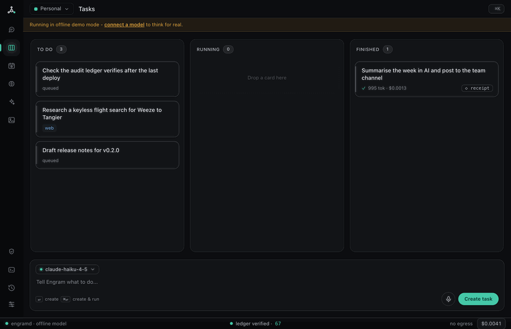
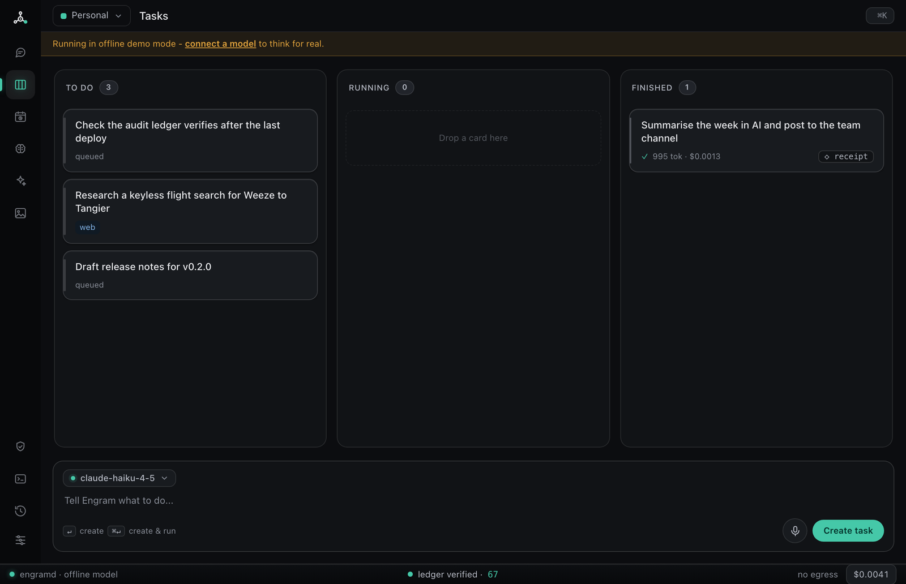
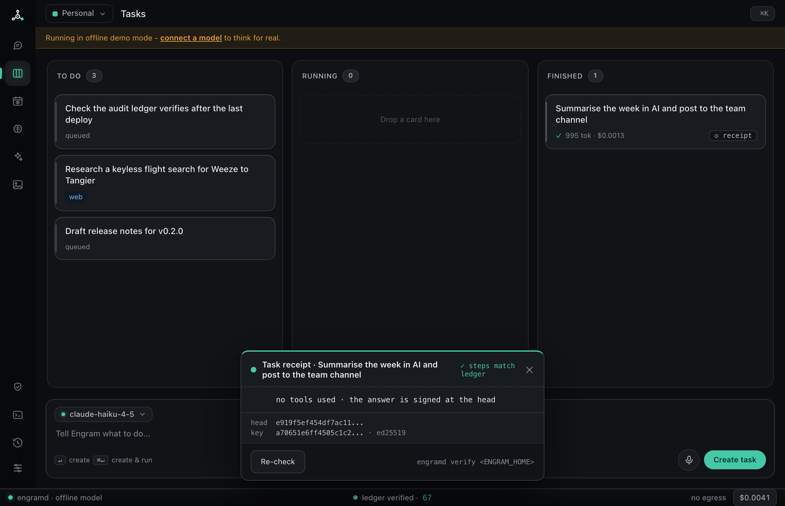
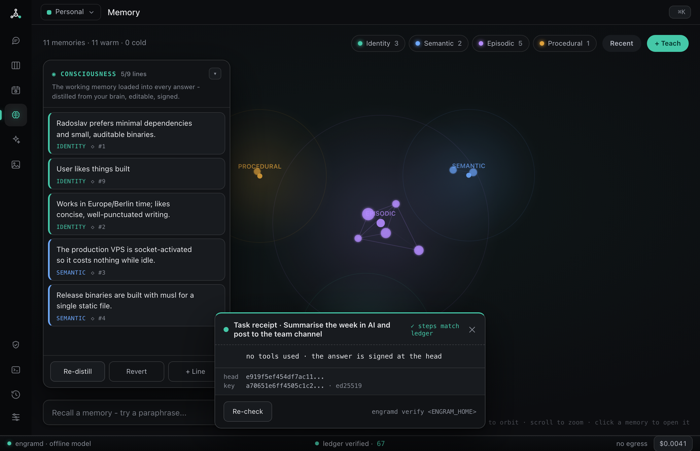
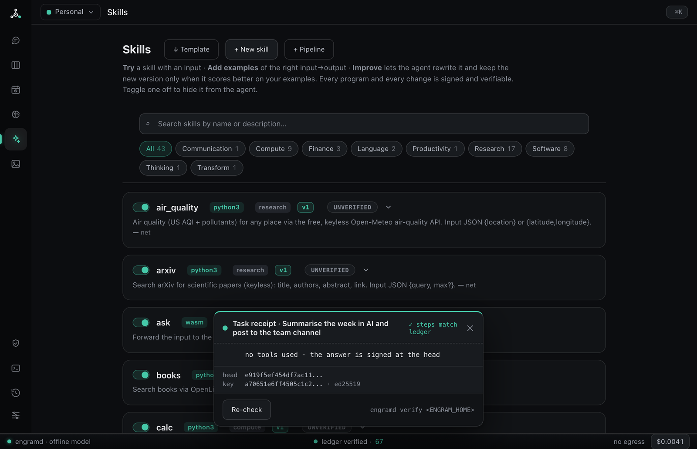

<p align="center">
  
</p>

<h1 align="center">Engram</h1>

<p align="center">
  <b>A personal AI agent with a brain you can watch grow — and a signed receipt for everything it does.</b>
</p>

<p align="center">
  It remembers what matters, gets a little better every time you use it, and drops to zero cost the moment you stop talking to it.
</p>

<p align="center">
  <a href="https://github.com/radotsvetkov/engram/actions/workflows/ci.yml"></a>
  <a href="LICENSE"></a>
  
  
  
</p>

<p align="center">
  
</p>

<p align="center"><sub>The desktop control center in offline demo mode — no API key needed to look around.</sub></p>

---

## What is this?

Engram is a personal AI agent modelled loosely on how a brain works. It keeps what
matters, forgets the rest, and improves the more you use it. It runs as a single small
Rust binary that sleeps to **zero resident memory** when nothing is happening and wakes in
milliseconds — so leaving it running costs you almost nothing.

Three things make it different from the usual agent setup:

- **It remembers you.** Memory is hybrid: it searches by meaning *and* by keyword at once,
  so a paraphrased question still finds the right fact even when it shares no words with how
  you first wrote it.
- **It proves what it did.** Every memory write, skill change, and tool call is signed,
  hash-chained, and append-only. You get a tamper-evident receipt you can verify offline —
  not a log you're asked to trust.
- **It grows.** Skills aren't prompts. They're small, signed programs that measure their own
  success and rewrite themselves toward it — only keeping a new version when it actually
  scores better on your examples.

## Who it's for, and the problem it solves

Agents got capable fast, and then a different question took over: *can I actually trust this
thing to run on my behalf?* The honest pain points are familiar by now — an always-on stack
quietly billing all month, an agent that says it did something it didn't, a tool call that
reads a poisoned web page and then reaches for your private data, and "self-improvement" you
can't inspect or undo.

Engram is for the developer or power user who wants a capable agent **and** wants to sleep at
night:

| The problem | Engram's answer |
|---|---|
| Always-on runtimes bill you 24/7 | Socket-activated Rust core — **0 MB resident and $0 at idle**, wakes in milliseconds |
| "Did it really do that?" | Every action is **Ed25519-signed and hash-chained**; verify the receipt offline |
| Prompt-injection → data exfiltration | A **taint boundary**: once a run reads untrusted content, the shell and egress are cut |
| Opaque self-modifying agents | Skills are **signed programs**, A/B-gated on your own examples, reverted in one click |
| Keyword search misses paraphrases | **Hybrid recall** (vectors + BM25) finds the fact even with zero shared words |

## Quickstart

**Grab a prebuilt binary** (fastest — no toolchain needed). Every release ships static
binaries for macOS (Intel + Apple Silicon) and Linux (x86_64 + arm64) on the
[releases page](https://github.com/radotsvetkov/engram/releases/latest). For example, on
Apple Silicon:

```sh
curl -fsSL https://github.com/radotsvetkov/engram/releases/latest/download/engram-v0.2.0-aarch64-apple-darwin.tar.gz | tar xz
./engram-v0.2.0-aarch64-apple-darwin/engramd    # → http://127.0.0.1:8088
```

**Build from source, one line** (needs a Rust toolchain; installs `engramd` and the
`engram` CLI into `~/.cargo/bin`):

```sh
curl -fsSL https://raw.githubusercontent.com/radotsvetkov/engram/main/install.sh | sh
```

Prefer to do it yourself? It's a normal Cargo build:

```sh
git clone https://github.com/radotsvetkov/engram.git
cd engram
cargo build --release            # the whole workspace, optimized
./target/release/engramd         # → open http://127.0.0.1:8088
```

That's the entire setup. With **no API key**, Engram runs in an honest offline demo mode —
memory, tasks, skills, scheduling, and the signed ledger are all live; only the model's
"thinking" waits for you to connect a provider in **Settings**. When you're ready:

```sh
cargo build --release --features http     # the real model/embedding provider
ENGRAM_ANTHROPIC_API_KEY=sk-... ./target/release/engramd
```

There's also a native desktop app and a terminal client — see [Desktop](#desktop) and
[Terminal](#terminal-cli--tui).

## A look around

<table>
  <tr>
    <td width="50%"></td>
    <td width="50%"></td>
  </tr>
  <tr>
    <td><b>One board, one composer.</b> Type to chat, ⌘+Enter to make a task, ⇧+⌘+Enter to run it. The trust spine at the bottom always shows the verified ledger and today's spend.</td>
    <td><b>A receipt, not a log.</b> Every finished task carries its signed ledger slice — the BLAKE3 head, the ed25519 key, and a one-command offline re-verify.</td>
  </tr>
  <tr>
    <td></td>
    <td></td>
  </tr>
  <tr>
    <td><b>A brain you can browse.</b> Memories are partitioned into regions (Identity, Semantic, Episodic, Procedural) with warm/cold tiers, and every one is signed and editable.</td>
    <td><b>Skills are programs.</b> A seeded library of signed skills the agent can search, run, and improve — each change gated on measured wins and reversible.</td>
  </tr>
</table>

## What makes it different

Most agent stacks are a Python and Node runtime that stays resident on a VPS, a keyword
memory file, and a tool loop that runs whatever the model asks. That's a fine starting point.
Engram makes three structural bets the usual setup can't retrofit later:

| | A typical always-on agent | Engram |
|---|---|---|
| **Idle cost** | resident process, hundreds of MB, billed by the hour | socket-activated, **0 MB** resident, **$0** at idle |
| **Footprint** | multi-hundred-MB runtime chain | one small static binary |
| **Memory** | keyword file with a size ceiling | hybrid vector + keyword recall, tiered, no hard cap |
| **Trust** | mutable log you review manually | signed, hash-chained ledger; **verify offline** |
| **Safety** | tools run without an egress boundary | **taint gate** cuts shell + egress after untrusted input |
| **Self-improvement** | patch code in place, no gate | signed skills, A/B-gated on your examples, reversible |

It's the same agentic surface you'd expect — a tool-use loop, sandboxed code execution,
files, web, an interactive browser, vision/image/speech, memory, MCP, subagents, and
messaging — with these guarantees built into the foundation rather than bolted on.

**Where it's still maturing** (stated plainly, because trust is the point): voice mode ships
as an API but has no packaged client yet; the out-of-the-box chat-platform count is smaller
than some (Telegram plus a generic webhook, with the MCP gallery covering the rest); and
live media plus true synonym-level recall need a provider key to light up. The default
offline build still does the full agentic loop, files, shell, web, the headless browser, and
morphological recall.

## Feature tour

- **Hybrid memory that survives sleep.** One embedded SQLite (WAL) file. Recall fuses a
  keyword arm (FTS5 / BM25) with a semantic arm (vector cosine) using Reciprocal Rank
  Fusion, and tells you which arm surfaced each hit. Idle consolidation moves stale facts
  warm → cold and prunes the rest, the way sleep does.
- **A signed audit ledger.** Append-only, content-addressed (BLAKE3), hash-chained, and
  Ed25519-signed. `engramd verify` replays the whole chain against the published public key
  **offline, without trusting the daemon** — exit 0 if intact, 1 if tampered at a named
  entry. A revert is a new entry pointing at a good hash; history is added to, never erased.
- **Security by construction.** The filesystem is confined to the workdir and the shell is
  off by default. The instant a run reads untrusted content it's *tainted*; after that the
  shell is refused and the model's secret-bearing context is stripped. **Egress** is cut once
  the run is *also* holding your private data — so pure web research keeps working, but a run
  that could leak your data can't carry it out.
- **Self-improving skills on two substrates.** Pure transforms run in a fuel-bounded,
  deny-by-default WASM sandbox; richer script skills (the seed library is Python) run behind
  an off-by-default shell gate and are network-isolated under Docker. A learning loop replays
  candidate versions against real inputs, A/B-gates them, and promotes only on a measured win.
- **Deterministic scheduling.** Natural language ("every weekday at 9am") parsed with no
  model call, plus generated systemd socket-activation and wake-timer units that make
  zero-idle and scheduled wake real on a small VPS.
- **A real toolset.** Memory, workdir-confined files, a multi-backend shell (local / Docker /
  SSH), keyless web search and fetch, a headless and an interactive Chrome browser over CDP,
  depth-bounded subagents, vision/image/speech through the metered gateway, Telegram and
  webhook messaging, and an **MCP client** that turns any Model Context Protocol server into a
  native, audited tool.
- **Provider-agnostic gateway.** Anthropic (native Messages transport with prompt caching and
  streaming) or any OpenAI-compatible backend — OpenAI, OpenRouter, Groq, DeepSeek, Mistral,
  Together, xAI, Perplexity, Google Gemini, and local Ollama / LM Studio / vLLM / llama.cpp —
  each with a built-in default endpoint, all metered and audited through one choke-point.

## Benchmarks

Numbers below are the actual output of the bundled harnesses on this workspace — reproduce
them yourself with the commands shown.

**Paraphrase recall** — `cargo run -p engram-bench`, over a 25-fact corpus and 17 paraphrase
queries (10 of which share no content word with their target):

| Embedder | Recall@10 | MRR | Recall@10 on zero-overlap paraphrases |
|---|---|---|---|
| trigram-hash (offline default) | **88%** (15/17) | **0.755** | **80%** (8/10) |
| keyword-only baseline | — | — | 0% (by construction) |

The offline default captures morphology and word order with **zero dependencies** — a real
step up over keyword matching, which scores nothing on the zero-overlap subset. For
synonym-level recall (*"purchasing a car"* → *"she bought a new automobile"*), enable the
pure-Rust static model2vec embedder (`ENGRAM_EMBED=static`) — no ONNX runtime, no heavy ML
crate, just a distilled matrix read from `model.safetensors`.

**Footprint** (from the same run): **8.5 MB** full-agent binary · **0 MB** resident memory at
idle (socket-activated).

**Agent regression suite** — `cargo run -p engram-eval` — replays real tasks through the real
agent and real tools with a scripted provider, fully deterministic:

```
PASS  remembers-then-recalls-then-answers
PASS  maintains-an-explicit-plan
PASS  stops-on-token-budget
PASS  stops-on-a-repeating-loop
4 passed, 0 failed, 4 total
```

## Examples

Everything the desktop does is a small, documented HTTP call, so it scripts cleanly.

```sh
# Ask a one-off question (offline mock or your configured model).
curl -s localhost:8088/v1/converse -H 'content-type: application/json' \
  -d '{"text":"What did we decide about the deploy window?"}'

# Teach it something durable.
curl -s localhost:8088/v1/remember -H 'content-type: application/json' \
  -d '{"region":"identity","text":"I prefer small, auditable binaries.","importance":0.9}'

# Recall by meaning — a paraphrase with no shared words still hits.
curl -s "localhost:8088/v1/recall?q=minimal%20dependency%20preference"

# Create a task and run it with the agent; the answer comes back with a signed receipt.
curl -s localhost:8088/v1/tasks -H 'content-type: application/json' \
  -d '{"title":"Draft release notes for v0.2.0","detail":"Group by area, human tone."}'

# Prove the whole audit chain is intact — offline, without trusting the daemon.
engramd verify
```

From the terminal client (starts the daemon for you if it isn't running):

```sh
engram ask "summarise my open tasks"     # streaming answer, real Markdown
engram memory recall "paraphrase here"   # hybrid recall from the CLI
engram ledger verify                      # exits non-zero on tamper — drops into CI
engram                                    # no args → full-screen TUI
```

## Configuration

Settings live in the desktop **Settings** panel (model/provider, embeddings, security gates,
budget, MCP servers, persona) and apply live without a restart. Everything is also an
environment variable, which is handy for headless deployments. The most useful ones:

| Variable | Default | Meaning |
|---|---|---|
| `ENGRAM_HOME` | `./brain` | State directory: SQLite memory, ledger, and signing keys. |
| `ENGRAM_ADDR` | `127.0.0.1:8088` | Address the HTTP API and dashboard bind to. |
| `ENGRAM_IDLE_SECS` | `900` | Idle window before the core sleeps to zero. |
| `ENGRAM_ANTHROPIC_API_KEY` | _(unset)_ | Native Anthropic provider (needs `--features http`); adds prompt caching + streaming. |
| `ENGRAM_LLM_BASE_URL` / `ENGRAM_LLM_API_KEY` | _(unset)_ | Any OpenAI-compatible provider (needs `--features http`). |
| `ENGRAM_MODEL` | `claude-haiku-4-5` | Model id for the tool-use loop and subagents. |
| `ENGRAM_EMBED` | _(unset)_ | `static` = pure-Rust synonym recall; `gateway` = provider embeddings; unset = offline trigram default. |
| `ENGRAM_TOOLS_SHELL` | _(unset)_ | `1` enables the `shell` tool (off by default; always refused once a run is tainted). |
| `ENGRAM_SHELL_BACKEND` | _(local)_ | `docker` (network-isolated) / `ssh` / `singularity`. |
| `ENGRAM_API_TOKEN` | _(unset)_ | Require `Authorization: Bearer <token>` on `/v1`. Set this whenever the daemon is exposed. |

The full list is in the source and the [Settings panel](#configuration); the offline defaults
need none of it.

## Desktop

A native [Tauri](https://tauri.app) shell wraps the control center and supervises the daemon —
a real desktop app, not a webview over a URL. It adds a system tray, close-to-tray, a native
menu bar, a global hotkey (Cmd/Ctrl+Shift+Space), run-at-login, window-state persistence, the
`engram://` deep-link scheme, and desktop notifications on task completion. One command builds
the daemon, stages it as the bundled sidecar, and launches:

```sh
scripts/desktop.sh          # needs: cargo install tauri-cli --version '^2'
scripts/desktop.sh build    # native bundle (.app / .dmg / .deb / .AppImage / .msi)
```

The macOS `.app` build is verified end to end (it weighs about 8 MB). See
[`desktop/README.md`](./desktop/README.md).

## Terminal (CLI & TUI)

The same control surface, keyboard-first. `engram` is a single small binary that talks to the
daemon over the very same HTTP API the desktop uses. Run it with no arguments for a
full-screen [ratatui](https://ratatui.rs) TUI — a streaming chat pane, a three-column kanban
with glass-box receipt cards, and views for Memory / Skills / Schedule / Autonomy / Ledger —
or use a subcommand for scripting, with `--json` on every command. Full reference in
[`docs/CLI.md`](./docs/CLI.md).

## Architecture

Engram is a Rust workspace of small, single-purpose crates. Capability comes from the right
primitives and isolation boundaries, not from a large codebase — and every crate that changes
state writes to the audit ledger first.

```
engram-core      reactive kernel: event bus, wake/sleep lifecycle, signed ledger
engram-memory    hybrid tiered memory on embedded SQLite (FTS5 + vectors)
engram-gateway   the single audited choke-point for every model & embedding call
engram-skills    signed, capability-sandboxed skills (WASM + process) + the learning loop
engram-sched     deterministic natural-language scheduling + systemd unit generation
engram-agent     the tool-use loop and the built-in tools
engramd          the daemon: HTTP API + desktop control center
engram-cli       the terminal client (scriptable CLI + full-screen TUI)
engram-bench     paraphrase-recall & footprint benchmark
engram-eval      deterministic, replay-based regression testing
```

The full walkthrough is in [`docs/ARCHITECTURE.md`](./docs/ARCHITECTURE.md), and the security
reasoning — threat by threat, with what ships today versus what's deferred — is in
[`docs/THREAT-MODEL.md`](./docs/THREAT-MODEL.md).

## Building & testing

Requires a stable Rust toolchain (see [`rust-toolchain.toml`](./rust-toolchain.toml)). The
release profile is tuned for a small, fast-to-load binary (`opt-level = "z"`, thin LTO,
`codegen-units = 1`, `panic = "abort"`, stripped). Everything builds and tests **offline**;
the network provider (`--features http`), document ingest (`--features docs`), and the
interactive CDP browser (`--features browser-cdp`) are opt-in.

```sh
cargo build --release        # optimized workspace build
cargo test --workspace       # kernel, memory, gateway, skills, scheduler, agent
cargo run -p engram-bench    # recall + footprint numbers
cargo run -p engram-eval     # deterministic agent regression suite
```

CI runs `fmt`, `clippy` (with `-D warnings`), the full test matrix across feature shapes, the
deterministic eval suite, a static musl build for the VPS target, and a desktop type-check —
see [`.github/workflows/ci.yml`](./.github/workflows/ci.yml).

## Roadmap

Delivered so far: the reactive core and signed ledger, hybrid tiered memory, the metered
gateway across a dozen providers, signed self-improving skills and their learning loop, the
scheduler, the full agentic tool loop (files, shell, web, interactive browser, media,
subagents, MCP, messaging), the desktop control center, the Tauri shell, and the CLI/TUI.

Next up:

- **A packaged voice client.** The loop already ships at `/v1/voice`; what's missing is a
  first-class client and word-by-word streaming.
- **Hardware-backed audit keys.** TPM / Secure Enclave / YubiKey or external co-signing to
  move the ledger from tamper-*evident* to tamper-*proof against host compromise*. The
  boundary is stated honestly in the threat model.
- **Broader messaging breadth**, with the MCP gallery narrowing the integration gap today.

## Contributing

Contributions are welcome — see [`CONTRIBUTING.md`](./CONTRIBUTING.md) for how to build, test,
and open a pull request, and [`SECURITY.md`](./SECURITY.md) for reporting a vulnerability
privately. Please keep the project's principle in mind: the smallest design that delivers the
capability wins.

## Design principles

- **Less is more.** Capability comes from architecture and the right primitives, not lines of code.
- **Transparent and auditable.** Every consequential action is logged, attributable, and reversible. You can watch the brain think.
- **Near-zero idle.** A single small binary that sleeps to nothing and wakes on an event. You should be able to forget it's running.
- **Skills are programs, not prompts.** Executable, versioned, sandboxed, and self-improving — under an explicit capability model, every change signed and reversible.

## License

Released under the **MIT License** — see [`LICENSE`](./LICENSE). MIT keeps things simple and
permissive: use it, fork it, ship it commercially, no strings beyond keeping the copyright
notice. (Apache-2.0 was considered for its explicit patent grant; MIT won on familiarity and
zero friction for a young project.)

Copyright © 2026 Radoslav Tsvetkov.
